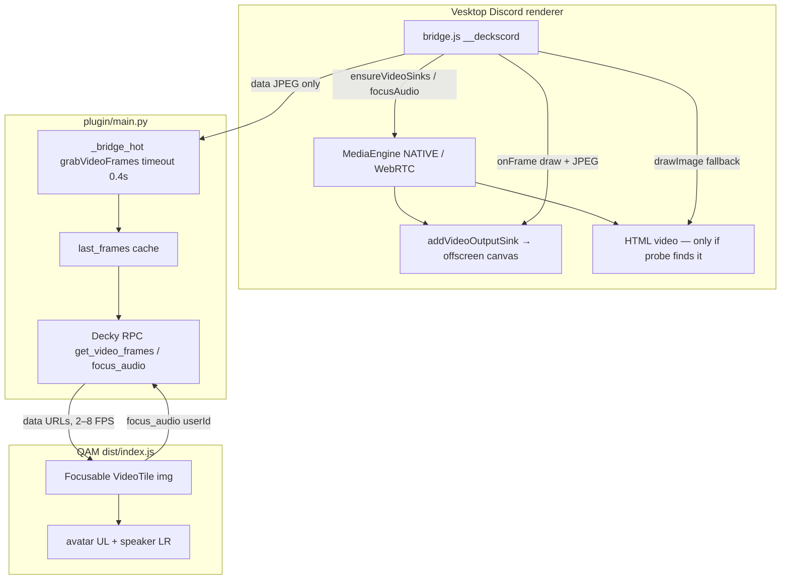
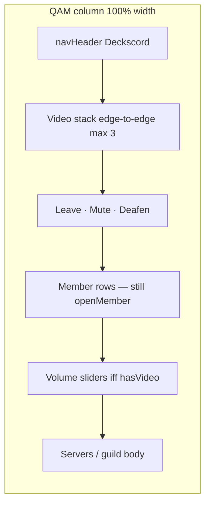
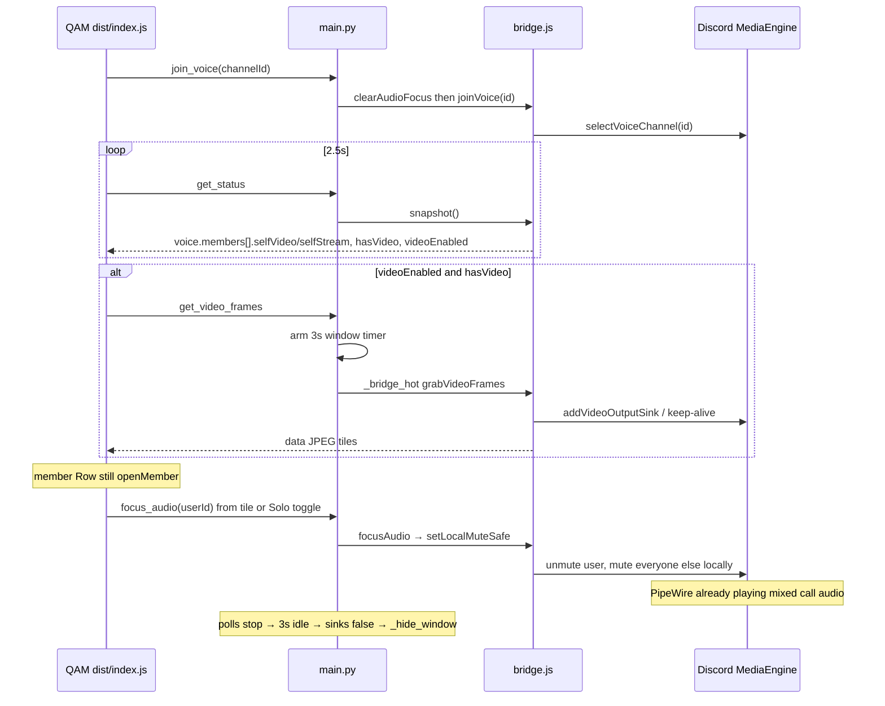

# Live Video Viewer in the Deckscord QAM

| Field | Value |
|---|---|
| **Author** | Deckscord / TBD |
| **Date** | 2026-08-28 |
| **Status** | Draft (rev 2 — review fixes) |
| **Scope** | Staging / architecture. No implementation in this document. |
| **Repo** | `/var/home/bazzite/Deckscord` |
| **Runtime plugin** | `/var/home/bazzite/homebrew/plugins/Deckscord` |
| **Audience** | Senior engineers who already know the QAM → Python CDP → Vesktop hop |

---

## Overview

Deckscord is not Discord rendered in the Quick Access Menu. The QAM (`plugin/dist/index.js`) talks to a stdlib Python backend (`plugin/main.py`) which drives Vesktop over Chrome DevTools Protocol. Remote WebRTC/native media lives only inside Vesktop’s Discord renderer (`plugin/bridge.js`). A `<video>` tag in the Decky plugin **cannot** be assigned `discordRemoteStream`.

This document proposes a live call video viewer that appears in the QAM **when the user is in a voice channel and at least one participant has camera or screen share**. Product rules:

- Every **copied** stream is on screen at once (video always on for those tiles). Streams beyond the copy cap go to an overflow page — not a promise that a 12-person call fits in the QAM column.
- **Audio is exclusive**: activating a tile focuses that user’s audio. A small indicator marks the focused tile.
- Each tile shows the streamer’s Discord avatar, small, upper-left, with alpha.
- Tiles stack **vertically**, **edge-to-edge** in the QAM column (~400px, `FILL` already used everywhere).
- **v1 includes screen share** as a second tile kind. **Self-view is shown last** if the local camera / Go Live is already on. No QAM control to start either.

The honest design is a **phased pixel pipeline** plus a **local-mute focus mixer**. Audio does **not** get a second path into the QAM; Discord already mixes call audio into PipeWire. Video pixels must be copied out of Vesktop because the QAM does not share a DOM or `MediaStream`. The expected Steam Deck case is Vesktop’s **NATIVE** media engine with **no** HTML `<video>` and **no** laid-out call tiles — PR 1 must attach Discord’s own frame sink (`addVideoOutputSink` or current wrapper) before PR 4 claims a camera path.

---

## Background & Motivation

### Current architecture

```
QAM (Steam CEF / Decky plugin dist/index.js)
  -> Python backend plugin/main.py (CDP client)
    -> Vesktop (Electron + Vencord) on localhost:9222
      -> plugin/bridge.js injected into Discord renderer
```

`docs/ARCHITECTURE.md` still lists “screen share / PiP” as later work. Voice + text are live.

Relevant facts already in the tree:

| Layer | What exists today |
|---|---|
| QAM UI | `plugin/dist/index.js` is the shipped frontend. `plugin/src/index.tsx` is a comment-only sketch. **No Node build pipeline.** Edits go in `dist/index.js`. |
| View stack | `home` / `dms` / `guild` / `chat` / `devices` / `member`. `push` / `back` / `handleCancel`. B pops until home, then QAM closes. |
| Voice chrome | `showVoicePanel = ready && view.page !== "chat" && view.page !== "member"`. PanelSection with Leave, Mute, Deafen, output/input `SliderField`s, devices button, member `Row`s. Render tree is always `navHeader`, then `voiceSection`, then `body` (`dist/index.js` ~980–989). |
| Snapshot | `window.__deckscord.snapshot()` reads `UserStore`, `GuildStore`, `ChannelStore`, `VoiceStateStore`, `MediaEngineStore`, `SelectedChannelStore`. Voice members come from `voiceMembersFor` → `memberFromState`. |
| Per-user audio | `setUserVolume` / `toggleUserMute` wrap `setLocalVolume` / `toggleLocalMute`. There is **no** `setLocalMute` wrapper today. Member page exposes volume + “Mute for me”. Voice-panel `Row` is `onClick: () => openMember(m)`. |
| Images in QAM | Login QR is a `data:image/png;base64,...` from `Page.captureScreenshot` (`Plugin._grab_login_qr`). Chat already renders `<video src=cdnUrl>` for **attachments**, not live WebRTC. Avatars load public `cdn.discordapp.com/avatars/…`. |
| Width | `FILL = { width:"100%", maxWidth:"100%", minWidth:0, overflowX:"hidden" }`. Horizontal overflow of `ButtonItem` has already been a real bug. |
| Polling | `get_status` every 2.5s when ready, 1s otherwise. Chat messages every 2.5s. `_bridge` always `_ensure_vesktop` + `_ensure_cdp` + `_inject_bridge` (which `ping()`s) + `_eval` (`main.py` 418–422). |
| Vesktop window | After login, **`get_status` minimizes** via `Plugin._hide_window` → `Browser.setWindowBounds` `{windowState: "minimized"}` (`main.py` 369–384, 585–586). **`launch-vesktop.sh` does not pass `--start-minimized`**; flags are only CDP. Login QR path uses `_ensure_cdp(..., hide=False)`. Plugin stays loaded when the QAM closes; `_unload` runs only on plugin unload. |

### Pain points this feature hits

1. **No shared media graph.** Steam CEF and Vesktop are separate Chromium instances. Tracks stop at Vesktop.
2. **Vesktop is minimized after login.** Discord’s media engine tracks active video output sinks. A minimized window often **stops decoding and painting** remote video. Screenshot-of-tile only works if something is actually painted **in the page compositor**. Native video may paint on a separate Electron surface.
3. **Snapshot does not know about video.** `memberFromState` (`bridge.js` 197–206) reads mute/deaf/volume/`localMute` but **ignores** `st.selfVideo` and `st.selfStream`.
4. **NATIVE engine likely has no HTML `<video>`.** `setHasActiveVideoOutputSink` (if it exists) keeps decoding; it does not mount Discord’s call UI and does not hand this plugin pixels. Frame attach is a separate API (`addVideoOutputSink` / `addDirectVideoOutputSink` or Discord’s current wrapper).
5. **QAM is a ~400×~650 content column** with a bulky voice panel. Layout must compact chrome and cap tile height.
6. **Gamepad.** Nested CSS overflow in the QAM gets focus stuck. B must still pop the view stack. Tiles must be `Focusable` with the existing `cancelBind` / `BackNav` pattern (`Row` in `dist/index.js`).

---

## Goals & Non-Goals

### Goals

- Show every **copied** camera and screen-share stream as a live-ish tile while the user is in the call. Copy cap: 3 on home / guild / dms, 4 on `page: "video"`; extras via overflow page.
- Play **all copied videos simultaneously**; **one audio source** at a time, selected by click / gamepad A on a **tile** (not by hijacking member-row A).
- Vertical stack, width `100%` of the plugin column, tiles touching the QAM sides (no extra horizontal padding on the video surface).
- Avatar overlay: small, upper-left, alpha, does not eat viewing space.
- Focused-audio indicator in a **non-colliding** corner (lower-right).
- Stay inside existing Deckscord constraints: stdlib Python, no pip, no Node build, CDP + `__deckscord.*`, gamepad B semantics, `FILL` width.
- Degrade on Steam Deck while a game is running: cap visible streams, FPS, and JPEG size.

### Non-goals (v1)

- Starting the user’s own camera or Go Live from the QAM. Self-view of an already-on camera **is** in v1 (last tile).
- A second audio device / PipeWire graph into the QAM. Call audio stays in Vesktop → PipeWire.
- Per-stream audio separate from the owner’s mic. Discord local mute is per user.
- Full-screen PiP over the game (Gamescope overlay). That is a later overlay feature, not this QAM viewer.
- True 30/60 FPS, 720p, or HDR. The QAM is a 400px column beside a running game.
- Stage-channel audience layout, Activities / embedded apps, Watch Together.
- Replacing the member list with black tiles for people who are not streaming.
- Shipping a Vencord plugin through Vesktop’s plugin installer. We keep using CDP-injected `bridge.js`.

---

## Proposed Design

### 1. First-class decision: audio stays in Discord

**Do not** capture remote audio, encode it, and play it in a QAM `<audio>` / `<video>` element.

Reasons:

- Vesktop already outputs mixed call audio to PipeWire (`launch-vesktop.sh` + Flatpak `--socket=pulseaudio` / `xdg-run/pipewire-0`).
- The QAM CEF process is a UI surface, not an audio endpoint. Dual playback would echo or fight the system mixer.
- `bridge.js` already has `toggleUserMute` → `toggleLocalMute` and `setUserVolume` → `setLocalVolume`. The member page already exposes them.
- Screen-share audio is mixed into that user’s Discord playback. Muting the owner locally is the correct “focus this stream” primitive. There is no per-stream local mute.

**Focus-audio semantics**

New bridge methods:

```js
window.__deckscord.focusAudio(userId)
window.__deckscord.clearAudioFocus()
```

In-memory shape, **one field name everywhere**:

```js
window.__deckscord._audioFocus = {
  userId: string | null,   // focused remote user; NEVER focusedUserId
  saved: { [userId]: { localMute: boolean, volume: number } }
}
```

Snapshot reads `_audioFocus && _audioFocus.userId` into `voice.focusedUserId` (wire name only). Python keeps a copy of the same `{ userId, saved }` map so re-inject and QAM-close cannot leave MediaEngine stuck.

**`setLocalMute`, not a blind toggle.** `toggleLocalMute` (`bridge.js` 599–612) is a flip. There is no `setLocalMute` wrapper in this repo today. Discord’s engine does expose `setLocalMute(userId, mute)` (MediaEngineActions / VoiceEngine). Wrap it:

```js
function setLocalMuteSafe(userId, mute) {
  var id = String(userId);
  var fn = findFn("setLocalMute");
  if (fn) { fn(id, !!mute); return; }
  var MediaEngineStore = store("MediaEngineStore") || byProps("isLocalMute", "getLocalVolume");
  var now = !!(MediaEngineStore && MediaEngineStore.isLocalMute && MediaEngineStore.isLocalMute(id));
  if (now !== !!mute) {
    var tog = findFn("toggleLocalMute");
    if (tog) tog(id);
  }
}
```

Never call `toggleLocalMute` without reading `isLocalMute` first. Never `setServerMute`.

Algorithm in Vesktop (all local):

1. Resolve `meId`. If `userId` is missing or `userId === meId` → **`clearAudioFocus()` and return**. Self tiles are visual only; A on self must not mute every remote user.
2. If `_audioFocus.userId === userId` already, no-op on the mixer (QAM uses this state for “second A opens member”).
3. Else if `_audioFocus` is set for someone else, restore **that** saved map first (do not stack exclusive passes).
4. Snapshot `isLocalMute(id)` and `getLocalVolume(id)` for every **non-self** member in the current voice channel into `saved`.
5. Persist `_audioFocus = { userId, saved }` in JS **and** return it so Python stores the same object.
6. `setLocalMuteSafe(userId, false)`. If `getLocalVolume(userId)` is `0`, `setLocalVolume(userId, 100)` — a focused user at volume 0 is silent and looks like a bug.
7. For every other non-self member: `setLocalMuteSafe(id, true)`. Do **not** rewrite their saved volume.
8. `clearAudioFocus()` applies `saved` (mute + volume) then sets `_audioFocus = { userId: null, saved: {} }`.

**When to clear (Python is the safety net; frontend unmount is not sufficient):**

| Event | Action |
|---|---|
| `leave_voice` | `clearAudioFocus()` **then** `leaveVoice()`. |
| `join_voice` | `clearAudioFocus()` **then** `joinVoice()` (covers hop without leave). |
| `snapshot()` | If `voice` is null or `voice.channelId` changed vs last snapshot, `clearAudioFocus()`. |
| QAM `VideoStack` unmount | Frontend calls `clear_audio_focus` (best-effort). |
| Bridge re-inject | JS `_audioFocus` dies; **MediaEngine mutes remain**. Python re-pushes `{ userId, saved }` into `__deckscord._audioFocus` after inject, or calls `clearAudioFocus` if the call is gone. Python is source of truth. |
| Feature flag off | `clearAudioFocus()` once; do not touch windows. |

Mixer edits on `page: "member"` while focused: do **not** clobber them until the next **explicit** `focusAudio`. `clearAudioFocus` still restores the **pre-focus** map (Issue 3 / Open Question 5 locked as exclusive-until-clear).

Screen share vs camera for the same user: both tiles share `userId`. Focusing either unmutes that owner.

### 2. How pixels get from Vesktop into the QAM

There is no `srcObject` hop. **PR 1 names the winner with captured JSON.** Implementers must not guess HTML `<video>` on NATIVE Vesktop.



**Fallback ladder (stop at the first PR 1 winner):**

| Rank | Option | What it is | When it is allowed |
|---|---|---|---|
| 1 | **F — native sink** | `addVideoOutputSink` / `addDirectVideoOutputSink` (or Discord’s current wrapper) → 400px offscreen canvas → JPEG in `bridge.js` | Probe finds the function and a `streamId`; `onFrame` yields `black: false` |
| 2 | **B — HTML `<video>`** | `ctx.drawImage(videoEl, …)` | Probe `dom[]` has `videoWidth > 0` in the **same** window mode grab will use |
| 3 | **A — CDP clip** | `Page.captureScreenshot` clip of Discord call tiles | PR 1 matrix showed **non-black** clips in that same window mode. Native video in a separate Electron surface does **not** count |
| 4 | **C — preview JPEG** | `await ApplicationStreamPreviewStore.getPreviewURL` then **fetch + toDataURL inside Vesktop** | Screenshare stills. Camera tiles stay placeholders. Never a raw CDN URL in the QAM |

`setHasActiveVideoOutputSink(userId, true, SINK_ID)` is **keep-alive only**. It is not a pixel API and it does not mount call UI. Probe must report whether keep-alive **alone** produces non-black frames (expected: no).

One sink id constant, everywhere:

```js
var SINK_ID = "deckscord-qam";
```

#### Option F — Native `addVideoOutputSink` (expected Deck path)

Hypothesis (not in this repo; PR 1 logs `typeof` / `Object.getOwnPropertyNames`):

```js
// VoiceEngine / MediaEngine — names are probe targets, not contracts
engine.addVideoOutputSink(SINK_ID, streamId, function onFrame(imageDataOrFrame) { /* draw */ });
engine.addDirectVideoOutputSink(SINK_ID, streamId, onFrame);
engine.removeVideoOutputSink(SINK_ID, streamId);
connection.setHasActiveVideoOutputSink(userId, true, SINK_ID);  // decode keep-alive only
```

`streamId` is **not** always `userId`. Camera vs Go Live use different keys (user id vs application stream key). Probe returns `streamIds: [{ userId, kind, streamId }]`.

In-renderer: register one sink per copied stream, draw into a reused 400×225 canvas, `toDataURL("image/jpeg", q)`, return data URLs. Teardown: `removeVideoOutputSink` + `setHasActiveVideoOutputSink(..., false, SINK_ID)` on idle (same timer as window hide).

This is post-DAVE-decrypt, same privacy as canvas grab. CPU is one JPEG encode per tile, not a compositor screenshot of the whole Discord UI.

#### Option A — CDP `Page.captureScreenshot` clip per tile

Already used for login QR:

```python
# plugin/main.py Plugin._grab_login_qr
shot = await self.cdp.call("Page.captureScreenshot", {
    "format": "png",  # QR only; video grabs use JPEG
    "clip": { "x", "y", "width", "height", "scale": 1 },
})
```

That path works because the **login page is visible** and a single SVG has a stable rect. Call tiles move, may not be mounted, and native video may not be in the page compositor. PNG clips of N videos are not proven by the QR helper.

**PR 3 must refuse Option A** unless the PR 1 matrix showed non-black clips in the **same** window mode PR 3 will use. If only Option C works, ship screenshare stills + camera placeholders — not fake black camera screenshots.

`Page.startScreencast` is rejected: it captures the **whole page**, is experimental, Chromium waits for `Page.screencastFrameAck`, and current `Cdp._recv_loop` **drops events without `id`** (`main.py` 174–189). Do not add an event dispatcher for v1.

#### Option B — In-renderer canvas grab of HTML `<video>`

Only if probe finds paintable elements. Same JPEG output as F.

`HTMLVideoElement.captureStream()` + `MediaRecorder` is not v1 (QAM CEF WebRTC unproven).

#### Option C — Discord preview URLs, resolved **inside Vesktop**

```js
var url = await ApplicationStreamPreviewStore.getPreviewURL(guildId, channelId, ownerId);
var blob = await fetch(url).then(function (r) { return r.blob(); });
// blob → data:image/jpeg;base64,…  (FileReader or canvas)
```

`getPreviewURL` is a **Promise**. `probeVideo` itself must be `async` so `_eval`’s `awaitPromise: true` waits. The QAM CEF process has **no Discord cookies**; a raw `cdn.discordapp.com/streams/…` `` will 401. Avatars work because they are public. **Never pass preview URLs to `dist/index.js`.** `grabVideoFrames` returns `data:image/jpeg;base64,…` only.

#### Option D — Local MJPEG HTTP from Python

Stdlib `asyncio.start_server` is possible; `aiohttp` is not. Steam CEF may block `http://127.0.0.1`. Data URLs already work (QR). Prefer data URLs unless CEF refuses high-rate `img.src`.

#### Option E — Un-minimize Vesktop / Gamescope PiP as the viewer

Out of product scope. The request is a **QAM** viewer. Window restore is only a decode pump, never the UI.

### 3. Probe (must ship before pixels)

`window.__deckscord.probeVideo()` is **`async`** and returns JSON-safe:

```js
{
  ok: true,
  inVoice: true,
  channelId: "...",
  engineType: "NATIVE" | "WEBRTC" | "DUMMY" | "unknown",
  members: [{ id, name, selfVideo, selfStream, localVideoDisabled }],
  videoParticipants: [ /* ChannelRTCStore.getVideoParticipants lite — if typeof function */ ],
  streamParticipants: [ /* getStreamParticipants lite */ ],
  streams: [ /* ApplicationStreamingStore.getAllApplicationStreamsForChannel */ ],
  streamIds: [{ userId, kind: "camera"|"screenshare", streamId: string|null }],
  sinkApi: {
    // probe hypotheses: log typeof / getOwnPropertyNames; continue if missing
    addVideoOutputSink: "function"|"undefined",
    addDirectVideoOutputSink: "function"|"undefined",
    removeVideoOutputSink: "function"|"undefined",
    setVideoOutputSink: "function"|"undefined",
    setHasActiveVideoOutputSink: "function"|"undefined",
    setLocalMute: "function"|"undefined",
    MediaEngineVideo: false
  },
  connections: [{ context, selfVideo, videoSSRC, disabledLocalVideos }],
  dom: [{ tag, className, w, h, readyState, hasSrcObject, hasCaptureStream, nearbyUserId, videoWidth }],
  window: { hidden: document.hidden, vis: document.visibilityState },
  windowState: "minimized"|"normal"|"maximized"|null, // from Browser.getWindowForTarget, filled in Python
  keepAliveAlonePaints: false,  // setHasActiveVideoOutputSink without addVideoOutputSink
  black: false,                 // mean luma < 8 on a downscaled canvas in bridge.js — NOT a JPEG SOI hash
  previewJpeg: "data:image/jpeg;base64,..." | null,  // never a CDN URL
  winner: "F"|"B"|"A"|"C"|null
}
```

Stores / APIs — **in-tree vs hypothesis**:

| API | Status | Why |
|---|---|---|
| `VoiceState.selfVideo` / `selfStream` | Fields exist on Discord VoiceState; **not read** in `memberFromState` today | Who is sending. Forward from PR 1. |
| `VoiceStateStore.getVideoVoiceStatesForChannel` / `hasVideo` | **Not in this repo.** Vencord types exist. Probe `typeof`. | Camera subset / cheap flag. Fallback: `members.some(m => m.selfVideo \|\| m.selfStream)`. |
| `ChannelRTCStore.getVideoParticipants` / `getStreamParticipants` | **Not in this repo.** Vencord exports the store. Probe `typeof`. | Camera vs Go Live; `localVideoDisabled`. |
| `ApplicationStreamingStore.getAllApplicationStreamsForChannel` | Vencord types; not in this repo | Screen shares. |
| `ApplicationStreamPreviewStore.getPreviewURL` | Vencord types; Promise | Still preview, resolved inside Vesktop. |
| `MediaEngineStore.getMediaEngine()` | Used indirectly today via mute/volume | `connections`, component presence. |
| `addVideoOutputSink` / `addDirectVideoOutputSink` | **Hypothesis.** PR 1 logs names. | Option F. |
| `setHasActiveVideoOutputSink(userId, bool, SINK_ID)` | **Hypothesis.** Same `SINK_ID` on add and remove. | Decode keep-alive only. |
| `setDisableLocalVideo` / `setLocalVideoDisabled` | **Hypothesis.** | Must **not** be used to “hide in QAM”; that stops decode. |
| `findFn("setLocalMute")` | **Hypothesis** (native VoiceEngine). Fallback: guarded `toggleLocalMute`. | Focus-audio. |
| DOM `querySelectorAll("video")` | In-renderer | Option B. |

Python: `Plugin.probe_video(restore=False)`. `restore=true` uses `set_window_mode` for the matrix, then idle-hides. Log at info: engine type, `sinkApi`, `streamIds`, `<video>` count, `black`, `windowState`. No QAM tiles.

**Gate:** PR 4 (live camera) does not start until PR 1 JSON names `winner` of F or B (or documents camera as placeholder-only). PR 3 still tiles may ship C + placeholders.

### 4. Vesktop window lifecycle (Python-owned idle timer)

After login, `get_status` minimizes via CDP. The launch script does **not**. Video grab must **opt out of that path and re-enter it on idle**.

**Do not key off `voice.hasVideo`.** That would un-minimize for any camera call even with the feature flag off and with the QAM closed.

Un-minimize **only** while:

- `get_video_frames` has been called in the last **3 seconds**, or
- `probe_video(restore=true)` is running.

Python:

```text
self._video_enabled          # from flag; get_status.videoEnabled
self._grab_alive_until       # monotonic deadline
SINK_ID = "deckscord-qam"
```

1. Flag off: never call `set_window_mode`, never `setHasActiveVideoOutputSink`. Still may snapshot `selfVideo` (harmless).
2. `get_video_frames` / probe restore: `self._grab_alive_until = now + 3s`. If currently minimized, `set_window_mode("offscreen"|"normal")` (PR 1 picks which Gamescope accepts). Then grab.
3. Background task (or the next `get_status`): if `now > _grab_alive_until`, `ensureVideoSinks(false)` then `_hide_window()`.
4. Closing the QAM stops frontend polls. Plugin process **stays up**. The 3s timer is what re-minimizes — **not** `useEffect` cleanup, **not** `_unload`.
5. Leave voice / flag off: clear deadline, teardown sinks, `_hide_window()`.

`set_window_mode(mode)` (PR 1) is the only CDP window helper besides `_hide_window`:

| mode | Bounds |
|---|---|
| `minimized` | `{ windowState: "minimized" }` (today’s `_hide_window`) |
| `normal` | `{ windowState: "normal", width: 480, height: 640 }` |
| `offscreen` | `{ windowState: "normal", left: -600, top: 0, width: 480, height: 640 }` |

PR 1 records which of `minimized` / `offscreen` / `normal` / `1×1` still produce `black: false` for the winning option. Do **not** require the user to look at Vesktop.

Pair every `setHasActiveVideoOutputSink(..., true, SINK_ID)` with `false` on idle / leave / flag off.

### 5. Snapshot additions (cheap, every 2.5s)

Extend `memberFromState` / `voice` in `snapshot()`:

```js
// member
selfVideo: !!(st && (st.selfVideo || st.self_video)),
selfStream: !!(st && (st.selfStream || st.self_stream)),

// voice
hasVideo: members.some(function (m) { return m.selfVideo || m.selfStream; }),
focusedUserId: (window.__deckscord._audioFocus && window.__deckscord._audioFocus.userId) || null,
streams: [ { userId, kind: "camera"|"screenshare", name, avatar } ]
```

`streams` is metadata only — **no JPEGs, no CDN preview URLs**. Frames go through `get_video_frames` as data URLs.

`get_status` also returns `videoEnabled: bool` (Python flag). JS does not keep a second `LIVE_VIDEO` constant that can drift.

### 6. Frame RPC (hot path)

`_bridge()` is too heavy for 3–8 Hz: `_ensure_vesktop` (`systemctl is-active`) + `_ensure_cdp` (inject) + `_inject_bridge` (`ping()`) + `_eval` at 12s timeout. Two extra CDP round-trips per frame, and a stuck grab holds in-flight for 12s. `_status_lock` does not cover this method, so snapshot and grab can contend on the renderer.

```python
async def _bridge_hot(self, call: str, timeout: float = 0.4) -> Any:
    """Assume an injected session. No systemctl, no ping, short timeout."""
    if not self.cdp.connected:
        raise ConnectionError("not connected")
    return await self._eval(f"window.__deckscord.{call}", timeout=timeout)

async def get_video_frames(self) -> dict[str, Any]:
    if not self._video_enabled:
        return {"ok": True, "frames": [], "videoEnabled": False}
    if self._status_lock.locked():
        return {"ok": True, "frames": self._last_frames, "cached": True}
    if self._grab_lock.locked():
        return {"ok": True, "frames": self._last_frames, "cached": True, "dropped": True}
    async with self._grab_lock:
        self._arm_grab_window()  # 3s idle timer; may set_window_mode
        try:
            r = await self._bridge_hot("grabVideoFrames()")
        except Exception as e:
            decky.logger.warning(f"grab: {e}")  # no JPEG body
            return {"ok": True, "frames": self._last_frames, "cached": True, "error": "grab_timeout"}
        if isinstance(r, dict) and r.get("ok") and r.get("frames"):
            self._last_frames = r["frames"]
        return r if isinstance(r, dict) else {"ok": False, "error": "bad response"}
```

First grab in a session may call full `_bridge` once to inject, then `_bridge_hot`. Log **Decky IPC byte size** of the response as well as CDP `video_grab_ms` (375 KB/s CDP is only hop 1 of 2).

Response (data URLs only):

```json
{
  "ok": true,
  "ts": 1770000000,
  "videoEnabled": true,
  "frames": [
    {
      "userId": "123",
      "kind": "camera",
      "name": "Alice",
      "avatar": "https://cdn.discordapp.com/avatars/...",
      "jpeg": "data:image/jpeg;base64,...",
      "w": 400,
      "h": 225,
      "fpsHint": 5,
      "black": false
    }
  ]
}
```

QAM: dedicated `useEffect` interval, **not** the 2.5s status tick. Update `img` via ref (`el.src = jpeg`). Skip if previous `get_video_frames` still in flight (`refreshBusy` pattern). Stop polling when `videoEnabled` is false or `voice.hasVideo` is false.

When `frames` is empty but `hasVideo` is true, keep last JPEG at reduced opacity, then avatar-only placeholder after 3s. If `black: true`, treat as placeholder — do not show a black rectangle and call it video.

### 7. QAM layout and navigation

Steam Deck QAM column ≈ **400px** wide. Content height ≈ **600–700px** minus plugin title. Existing `FILL` + `.deckscord-root{width:100%!important;overflow-x:hidden}` stays.

**Document order (one tree, both prose and diagram):** video stack **first** (the feature), then Leave / Mute / Deafen, then member rows, then volume sliders **only if** `videoEnabled && hasVideo`.



Do **not** auto-push a new page when joining a call. `join()` today does not push (`dist/index.js` 515). Auto-push would steal B.

**Exact render trees** (`navHeader` always first):

| `view.page` | `voiceSection` (`showVoicePanel`) | `body` |
|---|---|---|
| `home` / `guild` / `dms` | If `videoEnabled && voice.hasVideo`: **VideoStack (max 3, kind badge)** then compact Leave/Mute/Deafen then members then sliders. Else today’s panel (sliders stay where they are). | Unchanged (servers / channels / DMs). |
| `devices` | Today’s audio-only panel. **No video stack** (page is already long). | Unchanged device lists. |
| `chat` | **false** (unchanged). | Messages + composer + `ButtonItem` “Live video (N)” → `push({ page: "video" })` (PR 5). |
| `member` | **false** (unchanged). | Mixer + **ToggleField “Solo this user”** (PR 2). Member `Row` in the voice list stays `openMember`. |
| `video` | **false** (treat like chat — hide the bulky panel). | Compact Leave/Mute/Deafen + tiles (cap 4 copies) + overflow placeholders. QAM scroller only. PR 5. |

Slider relocation is gated on `videoEnabled && hasVideo`. It is **not** an unflagged move on every page.

**Sticky vs scroll**

- Document order, not `position:sticky`.
- No inner `overflow:auto` on the video stack. Chat already taught us nested scrollers trap d-pad (`src/index.tsx`: “Chat puts messages first (no nested scroller)”).
- At home, B is left to Steam (`canBack` false) so QAM closes. `page: "video"` is pushed, so existing `handleCancel` pops it.

**Tile geometry**

- Outer: `width:100%; maxWidth:100%; margin:0; padding:0; boxSizing:border-box`.
- Inner img: `width:100%; height:100%; display:block; background:#000`.
- Aspect: **16:9** (`aspectRatio: "16 / 9"`). Camera `object-fit: cover`; screenshare `object-fit: contain`.
- Height is a function of **copied count on this page**, and **does not change when overflow appears**:

| Copied N on this surface | Tile CSS height | Notes |
|---|---|---|
| 1 | 225px (400×9/16) | Comfortable. |
| 2 | 160px | Slight crop on camera. |
| 3 | 120px | Minimum useful. Home hard-cap. |
| 4 (`page: "video"` only) | 120px (same as N=3) | Do **not** shrink the first three when a 4th exists. Extra streams: `Row` “+K more videos” on home → `page: "video"`; on that page, copies 5+ are avatar placeholders. |

Home + 4th stream: three 120px tiles + overflow row. Adding the 4th must **not** jump 120 → 100.

**Who appears as a tile**

- Tile iff `selfVideo` or `selfStream` (or ChannelRTC VIDEO / STREAM if those methods exist).
- No-video members stay in the member list only. **No black tiles.** `black: true` frames are placeholders, not tiles of emptiness.
- Same user camera + screenshare → **two tiles**, distinguished by kind badge from PR 3 (not deferred).
- Self camera / self Go Live: **include, last in the stack**, half-opacity border. A on self → `clearAudioFocus` / no-op, not mute-all.

**Focus / input**

- Voice-panel **member `Row` stays `openMember`**. PR 2 does **not** change A on that row. No A-hold (DFL `Row` has none).
- PR 2: `page: "member"` ToggleField “Solo this user” bound to `focus_audio` / `clear_audio_focus`.
- Tiles (PR 3+): A → `focus_audio(userId)` if not already focused; A **while** `focusedUserId === userId` → `openMember(m)`. Implement in `VideoTile` only, not in `Row`.

**VideoTile skeleton** (copy this; do not invent a scrolling `div`):

```js
function VideoTile({ stream, focused, jpeg, onFocus, onOpenMember }) {
  const onCancel = useContext(BackNav);
  const imgRef = useRef(null);
  const go = () => {
    if (focused) onOpenMember(stream);
    else onFocus(stream.userId);
  };
  return e(
    Focusable,
    {
      className: fieldClass(),
      onActivate: go,
      onOKButton: go,
      onClick: go,
      ...cancelBind(onCancel),
      style: {
        ...FILL,
        position: "relative",
        aspectRatio: "16 / 9",
        padding: 0,
        margin: 0,
        overflow: "hidden",
      },
    },
    [
      e("img", {
        ref: imgRef,
        src: jpeg || undefined,
        alt: "",
        style: {
          width: "100%",
          height: "100%",
          objectFit: stream.kind === "screenshare" ? "contain" : "cover",
          display: "block",
          background: "#000",
        },
      }),
      e("div", { key: "av", style: { position: "absolute", top: 6, left: 6, pointerEvents: "none" } },
        e(Avatar, { src: stream.avatar, name: stream.name, size: 22, radius: 11 })),
      e("div", { key: "kind", style: { position: "absolute", top: 6, right: 6, pointerEvents: "none", fontSize: 14, opacity: 0.75 } },
        stream.kind === "screenshare" ? "🖥" : "📷"),
    ]
  );
}
```

Overlays are `pointerEvents: "none"` and not `Focusable`. No `overflow: auto`. Audio pill / green ring land in PR 5 as extra absolutely-positioned children with the same rule.

### 8. Avatar overlay and audio indicator

**Avatar (product: upper-left, small, alpha)**

| Token | Value |
|---|---|
| Position | `top: 6px; left: 6px` |
| Size | **22px** (member list uses 32 / 28 / 22; 22 matches chat authors) |
| Shape | `borderRadius: 11` (circle) |
| Opacity | **0.88** on the image |
| Contrast | `box-shadow: 0 0 0 1px rgba(0,0,0,0.55), 0 1px 4px rgba(0,0,0,0.45)` plus a **16px dark scrim** behind the corner: linear-gradient from `rgba(0,0,0,0.45)` at the corner to transparent 48px. Reuse existing `Avatar`. |
| Fallback | Letter tile already implemented when `src` fails. |

Do **not** put the display name on the tile.

**Kind badge (upper-right) — ships with tiles (PR 3)**

- 📷 camera / 🖥 screenshare, 14px, opacity 0.75, 6px inset. Two tiles of the same user are otherwise identical.

**Audio indicator (must not collide with avatar) — PR 5**

- **Lower-right**, 6px inset.
- Only on the focused tile (`voice.focusedUserId === tile.userId`).
- Dark pill `background: rgba(0,0,0,0.55); border-radius: 4px; padding: 3px 5px`.
- Glyph: three CSS bars (10×12px) in Discord green `#3ba55d`. Fallback `🔊`.
- Focused tile also gets a **2px inset box-shadow** `#3ba55d`. Gamepad focus stays `HighlightOnFocus` / `fieldClass()`; the green ring is audio-focus.

Until PR 5, “Solo this user” on the member page plus `focusedUserId` in snapshot is the only focus chrome (PR 2).

### 9. Performance budget (Steam Deck, game running)

Assume LCD Deck, 12–15W TDP, AAA title in Gamescope, Vesktop already decoding N remote streams.

| Budget | Cap |
|---|---|
| Copied streams | **3** on home / guild / dms, **4** on `page: "video"` |
| Capture size | max width **400**, height from 16:9 (225) or less |
| Encode | JPEG quality **0.40** camera, **0.50** screenshare |
| FPS | 1 stream: **8**; 2 streams: **5**; 3+: **3**. Unfocused tiles can run at **2**. If `grabVideoFrames` takes >80ms, drop FPS. |
| Status poll | unchanged 2.5s |
| Frame poll | `1000 / fps` on a single timer; skip if previous RPC in flight **or** `_status_lock` held |
| Bandwidth | 3 × 25KB JPEG × 5 FPS ≈ **375 KB/s CDP** plus the same again on Decky `api.call`. Log both. |
| CPU | Prefer Option F (already-decoded frames) over compositor screenshots. Never PNG. Never `Page.startScreencast`. |

If PR 1 shows native decode cost is already high, **default FPS to 3** even for one tile. There is no clean “game is running” signal in the plugin today.

### 10. Sequence: join call → see video → focus audio



---

## API / Interface Changes

No public HTTP API. Decky `api.call` methods only.

### New Python methods (`plugin/main.py`)

| Method | Bridge | Notes |
|---|---|---|
| `probe_video(restore=False)` | `probeVideo()` async | Discovery. `restore=true` uses `set_window_mode` then idle-hides. |
| `set_window_mode(mode)` | CDP `Browser.setWindowBounds` | `minimized` / `normal` / `offscreen`. Probe + grab timer only. |
| `get_video_frames()` | `_bridge_hot("grabVideoFrames()")` | Latest JPEGs. 0.4s timeout. Serves `_last_frames` if lock/timeout. Arms 3s window timer. |
| `focus_audio(user_id)` | `focusAudio(uid)` | Exclusive local unmute via `setLocalMuteSafe`. Stores `{ userId, saved }` in Python. |
| `clear_audio_focus()` | `clearAudioFocus()` | Restore saved mute/volume. |

`leave_voice` and `join_voice` both call `clearAudioFocus()` **first**. `get_status` / `snapshot` clears when `voice` is null or `channelId` changes. `get_status` returns `videoEnabled`.

### New / extended bridge methods (`plugin/bridge.js`)

| Function | Role |
|---|---|
| `memberFromState` | Add `selfVideo`, `selfStream`. |
| `snapshot` | Add `voice.hasVideo`, `voice.focusedUserId` from `_audioFocus.userId`, `voice.streams[]` (metadata). Clear focus if channel gone. |
| `probeVideo` | **async.** Store + DOM + `sinkApi` typeof dump + `streamIds` + luma `black`. |
| `grabVideoFrames` | JPEG **data URLs** only; caps applied; `black` per frame. |
| `focusAudio` / `clearAudioFocus` | `setLocalMuteSafe`; `_audioFocus = { userId, saved }`. |
| `ensureVideoSinks(enable)` | Hypothesis: `addVideoOutputSink` / `setHasActiveVideoOutputSink(..., enable, SINK_ID)` with `SINK_ID = "deckscord-qam"`. |
| `setLocalMuteSafe` | `findFn("setLocalMute")` or guarded toggle. |

### QAM (`plugin/dist/index.js`)

```js
const getVideoFrames = backend("get_video_frames");
const focusAudio = backend("focus_audio");
const clearAudioFocus = backend("clear_audio_focus");
// videoEnabled comes from status.videoEnabled — no second JS constant
```

`VideoTile` as in §7. `showVoicePanel` becomes `ready && view.page !== "chat" && view.page !== "member" && view.page !== "video"`.

### Before / after snapshot fragment

**Before** (`memberFromState` today): `id, name, avatar, muted, deaf, self, volume, localMute`.

**After:** same + `selfVideo, selfStream`. `voice` + `hasVideo, focusedUserId, streams`. `get_status` + `videoEnabled`.

---

## Data Model Changes

No on-disk schema. `DATA_DIR` (`~/.local/share/deckscord`) is unused for this feature.

```text
# JS (must match Python)
window.__deckscord._audioFocus = {
  userId: string | null,
  saved: { [userId]: { localMute: bool, volume: number } }
}

# Python
Plugin._video_enabled: bool                 # authoritative flag; default False until PR 5
Plugin._grab_alive_until: float
Plugin._last_frames: list[dict]             # served on skip/timeout; no re-grab
Plugin._audio_focus: { userId, saved }      # survives bridge re-inject
Plugin._grab_lock: asyncio.Lock
SINK_ID = "deckscord-qam"
```

Migration: none. Re-inject restores `_audioFocus` from Python or clears MediaEngine if the call is gone.

---

## Alternatives Considered

### 1. WebRTC / `captureStream()` from Vesktop into QAM `<video>`

- **+** Real video, better FPS.
- **−** QAM CEF WebRTC unproven; native MediaEngine may not expose `MediaStream`; weeks before a tile.
- **Reject for v1.** Revisit only if PR 1 shows clean `srcObject` **and** CEF `RTCPeerConnection` works in a spike.

### 2. `Page.startScreencast` of the Discord window

- **+** Event-driven frames.
- **−** Whole-page JPEG; `Cdp._recv_loop` drops events; Chromium CPU (crbug 40934921); minimized window; UI chrome in the frame.
- **Reject.** Do not add a CDP event dispatcher for v1.

### 3. Always-on Discord stream preview JPEGs only (raw CDN URL in QAM)

- **+** Trivial.
- **−** Camera-blind; seconds of latency; **QAM CEF 401** on session preview URLs.
- **Use as Option C** only after Vesktop `fetch` → data URL. Not the whole product.

### 4. PipeWire / `pw-record` of Vesktop + ffmpeg tiles

- **−** Whole window, not per-user; ffmpeg not in the plugin dependency story; Flatpak; Gamescope.
- **Reject.**

### 5. Auto-push `page: "video"` on join

- **−** Breaks B. Join today does not push. Chat hides the bulky voice panel on purpose.
- **Reject auto-push.** Explicit video page from chat and overflow (PR 5).

### 6. Native `addVideoOutputSink` → JPEG in-renderer (preferred vs Option B)

Discord abandoned copying ImageData through context isolation in favor of output sinks + a canvas renderer. Attaching **our** sink is how we get pixels on NATIVE without mounting call UI and without compositor screenshots.

| | Option F (sink) | Option B (`<video>`) | Option A (clip) |
|---|---|---|---|
| Expected on Vesktop NATIVE | **Yes, if probe finds it** | Unlikely | Unlikely unless call UI is laid out and composited |
| CPU | Decode (already) + small JPEG | Decode + drawImage + JPEG | Full page raster + clip + JPEG |
| E2EE | Post-decrypt (same) | Post-decrypt | Post-composite |
| Complexity | Webpack/native name drift | DOM stability | Window mode + tile layout |
| Needs visible call UI | No | Video element must exist | Yes |

**Prefer F if PR 1 finds it.** B is the fallback when `videoWidth > 0`. A is last and gated on non-black clips. This is not optional flavor — without F or B, v1 camera is placeholders.

---

## Security & Privacy Considerations

| Threat | Severity | Mitigation |
|---|---|---|
| Video frames in Python logs | High | Never `decky.logger` JPEG bodies, data URLs, or preview URLs. Log counts, `userId`, `black`, byte sizes. |
| Frames on the CDP WebSocket | Medium | Localhost `127.0.0.1:9222` already trusted. Do not bind a new interface. |
| Accidental server mute | High | Focus-audio uses **only** `setLocalMuteSafe` / `setLocalVolume`. Never `setServerMute` / `setServerDeaf`. |
| Leaving a call with everyone locally muted | Medium | `leave_voice` **and** `join_voice` **and** snapshot-on-channel-gone. Python copy of `saved`. Re-inject restores or clears. Do not rely on QAM unmount. |
| Vesktop window leaking into Gamescope after QAM close | High | Un-minimize only on grab/probe; **3s Python idle** → `_hide_window`. Never key off `hasVideo`. Flag off skips window changes. |
| Blind `toggleLocalMute` unmuting the wrong people | High | `setLocalMuteSafe`; self-tile no-op. |
| QAM `` 401 / leaking session preview URLs | Medium | Resolve previews inside Vesktop; data URLs only. |
| QAM showing a stream the user is not allowed to see | Low | Mirror what Vesktop already decoded. |
| JPEG SOI “blackness” false negatives | Low | Mean luma on a downscaled canvas in `bridge.js`, not first-16-bytes of base64. |

Auth model unchanged: no Discord user token in the plugin.

---

## Observability

Logging (`decky.logger`; no image payloads):

- `probe_video`: engine type, `sinkApi` typeof map, `streamIds`, `<video>` count, `document.hidden`, `windowState` from `Browser.getWindowForTarget`, `black` (mean luma < 8), `winner`.
- `get_video_frames`: `n`, **CDP bytes**, **Decky IPC bytes**, `ms`, `dropped`, `cached`. Rate-limit to 1/5s.
- `focus_audio`: `user_id`, member count muted, whether `setLocalMute` existed.
- Sink / store misses: warning, degrade to placeholders.

Metrics: `video_grab_ms`, `video_jpeg_bytes`, `video_fps_effective`, `video_streams_copied`. If `video_grab_ms > 100` for 10s, self-throttle.

QAM: last JPEG → 3s → avatar on black + Sub “Waiting for video…”. Do not `setError` on the global amber line. Do not present `black: true` frames as live video.

---

## Rollout Plan

Decky plugin, not multi-tenant. Sequential PRs + Game Mode soak.

1. **One flag, Python-authoritative:** `Plugin._video_enabled = False`. `get_status` returns `videoEnabled`. JS reads `status.videoEnabled`. Default **false** until PR 5. Flag off: no window changes, no sinks, no grab.
2. **Stage 0** — probe + `set_window_mode` matrix in a call with 1 camera + 1 screenshare. Capture JSON (`winner`, `black`, `sinkApi`).
3. **Stage 1** — Solo ToggleField on member page. Confirm PipeWire; member rows still open the mixer.
4. **Stage 2** — still tiles at 1 FPS on home, flag still false except on the developer machine.
5. **Stage 3** — live 3–8 FPS, idle hide, Game Mode + a game running.
6. **PR 5** sets `_video_enabled` default True after soak.
7. **Rollback:** `_video_enabled = False`; `clearAudioFocus`; `_hide_window`. No data migration.

---

## Risks

| Risk | Severity | Mitigation |
|---|---|---|
| NATIVE engine, no HTML video, no composited tiles | **High** | Option F first; PR 1 JSON names winner; PR 3 ships placeholders rather than black clips. |
| `addVideoOutputSink` renamed / missing | **High** | Probe `typeof`; continue; camera placeholders. |
| Minimized Vesktop does not decode | **High** | Grab-armed window timer; keep-alive paired with `false` on idle. |
| QAM close leaves Vesktop visible in Gamescope | **High** | 3s Python idle; never `hasVideo` OR; flag off skips windows. |
| Blind toggle unmutes the wrong member | **High** | `setLocalMuteSafe`; self no-op; Python `saved` map. |
| CDP JSON + Decky IPC saturates while a game runs | **High** | `_bridge_hot`; cap N/FPS/JPEG; cache `_last_frames`; never PNG. |
| QAM height: 3×120 tiles + chrome + servers | **High** | Video first; sliders only if `hasVideo`; overflow page; no nested scroll. |
| Preview URL 401 in QAM CEF | **Medium** | Data URLs from Vesktop fetch. |
| Gamepad stuck in overflow | **Medium** | `VideoTile` skeleton; `cancelBind`; no inner scroller. |
| Discord webpack store renames | **Medium** | `store()` / `byProps()`; probe fails soft. |
| Off-screen X11 flash in Gamescope | **Medium** | PR 1 matrix; idle hide. |
| Self-view (visual only) | **Low** | Last tile; A does not mute-all. |

---

## Key Decisions

1. **Audio is Discord-local exclusive mute, not a QAM media path.** `focusAudio` uses `setLocalMuteSafe` (not a blind `toggleLocalMute`) and `setLocalVolume`. PipeWire remains the speaker. Self tiles do not mute remotes. Volume 0 on focus bumps to 100.
2. **Pixels are JPEG data URLs, not `srcObject` and not CDN preview URLs.** Ladder: **F (native sink) → B (HTML video) → A (gated clip) → C (screenshare stills + camera placeholders).** `setHasActiveVideoOutputSink` is keep-alive only.
3. **Frames never ride `get_status` / `snapshot()`.** Hot path is `_bridge_hot` + `_last_frames` cache. Membership metadata can ride snapshot; JPEG cannot.
4. **No auto-pushed video page.** Home/guild/dms put VideoStack **first** in `voiceSection`. `page: "video"` is opt-in from chat/overflow and **hides** `voiceSection` (`showVoicePanel` false). `devices` has no tiles. B stays predictable.
5. **Empty members are not tiles.** Only `selfVideo` / `selfStream` (and ChannelRTC VIDEO/STREAM if present). `black: true` is a placeholder, not a tile.
6. **Max 3 copied streams on home, 4 on `page: "video"`, 16:9, width 100%, camera `cover` / screenshare `contain`.** Height table is locked for N=1..3; overflow does **not** resize the first three. Extras go to the overflow page. “Visible at once” means copied streams, not the whole call.
7. **Avatar 22px, 0.88 alpha, upper-left + dark corner scrim. Kind badge upper-right ships with tiles. Audio pill + green ring lower-right in polish.** No name on the tile.
8. **Vesktop window: after login, `get_status` minimizes via CDP; the launch script does not.** Grab opts out **only** while `get_video_frames` / `probe_video(restore=true)` has been called in the last 3s. Python re-minimizes on idle. Never key off `hasVideo`. Flag off skips window changes. `SINK_ID = "deckscord-qam"` on keep-alive true **and** false.
9. **Shipped UI is `plugin/dist/index.js`. No bundler.** Bridge remains CDP-injected `bridge.js`. Python stays stdlib.
10. **Probe before pixels.** PR 1 returns captured JSON (`winner`, `sinkApi`, `streamIds`, `black`, `windowState`). Later PRs branch on that file. PR 4 does not start without F or B for cameras.
11. **Screen share is in v1** as a second tile kind (`contain`), using Option C until live grab works for that stream.
12. **Self-view is in v1**, last in the stack, if already enabled. No “turn camera on” control.
13. **Focus is exclusive** until `clearAudioFocus` or a new explicit focus. Member-page mixer is for a custom mix; focusing a tile again resets to exclusive. Member **rows** still open the mixer (A unchanged).
14. **Volume sliders move below members only when `videoEnabled && hasVideo`.** Not on `devices`, not when the flag is off.
15. **One feature flag:** Python `_video_enabled`, default **false** until PR 5. JS reads `status.videoEnabled`.

---

## Open Questions

Probe / soak can still change these; they are not required to start PR 1–2.

1. **Off-screen vs tiny 480×640 vs 1×1:** which Gamescope actually accepts without a visible flash? (PR 1 matrix)
2. **Gamepad second action on tiles:** A-while-focused → member mixer (locked for v1). Face-button chord only if soak shows accidental mixer opens.
3. **Do we ever want to unmute stream audio separately from the owner’s mic?** Discord cannot; accept unless a new MediaEngine API appears.
4. **Aspect jitter:** locked 16:9 for v1. Source `videoWidth/videoHeight` would jump gamepad layout — still deferred.
5. **Max copies while a game is running:** 3/4 stays unless PR 4 soak forces 2.

Promoted out of this list (now Key Decisions 11–15): screen share in v1, self-view last, exclusive mute, sliders only when `hasVideo`, flag polarity.

---

## References

- Repo architecture: `/var/home/bazzite/Deckscord/docs/ARCHITECTURE.md`
- QAM UI (source of truth): `/var/home/bazzite/Deckscord/plugin/dist/index.js` — `FILL`, `Row`, `Avatar`, `fieldClass`, `cancelBind`, `BackNav`, `App` view stack, `showVoicePanel`, `voiceSection`, `join()` does not push, render order `navHeader` / `voiceSection` / `body`
- Bridge: `/var/home/bazzite/Deckscord/plugin/bridge.js` — `memberFromState` (no `selfVideo` today), `voiceMembersFor`, `snapshot`, `toggleUserMute` → `toggleLocalMute` (flip), `setUserVolume` → `setLocalVolume`
- Backend: `/var/home/bazzite/Deckscord/plugin/main.py` — `Cdp` (events without `id` dropped in `_recv_loop`), `Plugin._eval` (`awaitPromise: true`, 12s default), `Plugin._bridge`, `Plugin._hide_window` (post-login `get_status` only), `Plugin._grab_login_qr`, `_unload` on plugin unload only, `_status_lock` around `get_status`
- Launch: `/var/home/bazzite/Deckscord/launch-vesktop.sh` — CDP 9222, X11, **no** `--start-minimized`
- In-tree vs not: `ChannelRTCStore` / `ApplicationStreamingStore` / `ApplicationStreamPreviewStore.getPreviewURL` exist in public Vencord types, **not** in this repo. `setHasActiveVideoOutputSink` / `addVideoOutputSink` / `setLocalMute` / `getVideoVoiceStatesForChannel` / `hasVideo` are **probe hypotheses**.
- Prior art: Vencord `biggerStreamPreview` (preview URLs, not live frames; those URLs must not be used as QAM `img src`)

---

## PR Plan

Each PR is independently reviewable. Later PRs no-op if the probe kills a path. **Flag stays false until PR 5.**

### PR 1 — Video discovery probe + window modes

- **Title:** `probe: inventory Discord video sinks and window modes`
- **Files:** `plugin/bridge.js`, `plugin/main.py`
- **Depends on:** nothing
- **Description:** `async probeVideo()` + `Plugin.probe_video(restore=)`. `set_window_mode(minimized|normal|offscreen)` used **only** by the probe (restore minimized when the matrix step finishes — no `hasVideo` policy). Extend `memberFromState` with `selfVideo` / `selfStream`; snapshot `hasVideo` + `streams[]` metadata (no JPEGs). Log `sinkApi` typeof / `getOwnPropertyNames`, `streamIds`, `<video>` count, luma `black`, `windowState`. Document the matrix file: window mode × camera × screenshare → `winner` F/B/A/C. No user-facing UI. **Does not** implement idle-timer grab policy yet.

### PR 2 — Exclusive focus-audio on the member page only

- **Title:** `voice: exclusive local-mute via setLocalMuteSafe`
- **Files:** `plugin/bridge.js` (`setLocalMuteSafe`, `focusAudio`, `clearAudioFocus`, `_audioFocus = { userId, saved }`), `plugin/main.py` (`focus_audio`, `clear_audio_focus`, Python copy of the map, `leave_voice` **and** `join_voice` clear first, snapshot-on-channel-gone), `plugin/dist/index.js` (**ToggleField “Solo this user” on `page: "member"` only**; voice-list `Row` still `openMember`)
- **Depends on:** nothing required from PR 1 except member `id`s (already exist). **`focusedUserId` is implemented here**, not in PR 1.
- **Description:** Exclusive mixer with `setLocalMute` or guarded toggle. Self no-op. Volume 0 → 100. Snapshot `voice.focusedUserId` from `_audioFocus.userId`. Leave / join / missing voice restores. No tiles. No A-hold. No change to member-row A.

### PR 3 — Home still tiles (1 FPS) + kind badge, flag off

- **Title:** `qam: edge-to-edge still video tiles on home`
- **Files:** `plugin/bridge.js` (`grabVideoFrames` at ~1 FPS using **PR 1 winner**; preview fetch → data URL for C), `plugin/main.py` (`get_video_frames` via `_bridge_hot`, `_last_frames`, **3s idle re-minimize** — first user-facing un-minimize must not leak), `plugin/dist/index.js` (`VideoTile` skeleton, VideoStack **first** in `voiceSection` on home/guild/dms, kind badge, `FILL` 16:9, sliders below members **iff** `videoEnabled && hasVideo`)
- **Depends on:** PR 1 JSON winner; PR 2 `focus_audio` (tile A → focus; A while focused → `openMember`)
- **Description:** Home-only. Cap 3. Flag **off** by default (`videoEnabled` false) so soak is opt-in on the dev machine. **Refuse Option A** unless PR 1 showed non-black clips in the same window mode; otherwise screenshare stills + camera placeholders. Kind badge in this PR (camera + screenshare of one user). **No** `page: "video"` yet. **No** audio pill/ring yet.

### PR 4 — Live-ish FPS + native sinks + idle sink teardown

- **Title:** `video: raise grab rate, attach sinks, idle teardown`
- **Files:** `plugin/bridge.js` (`ensureVideoSinks` true/false with `SINK_ID`, FPS/quality caps, Option F onFrame path if winner), `plugin/main.py` (in-flight skip, Decky+CDP byte logs, window timer already from PR 3), `plugin/dist/index.js` (frame poller, stall / `black` placeholder, height-by-copied-N locked table)
- **Depends on:** PR 3; **blocked** on PR 1 `winner` ∈ {F, B} for a live **camera** path. If winner is C only, this PR raises screenshare still rate and leaves cameras as placeholders.
- **Description:** 3–8 FPS budget. Pair keep-alive `false` on idle. Screenshare `contain`, camera `cover`. No WebRTC.

### PR 5 — Pill/ring, overflow page, chat entry, flag on

- **Title:** `qam: live video polish — focus pill, overflow page, default on`
- **Files:** `plugin/dist/index.js` (lower-right audio pill + green ring, `page: "video"` with `showVoicePanel` false, chat `ButtonItem`, overflow row, cap 4 on that page), `plugin/main.py` (default `_video_enabled = True`), `plugin/src/index.tsx` (update the sketch comment), `docs/ARCHITECTURE.md` (QAM shows JPEG copies; audio is local mute; window idle-hide)
- **Depends on:** PR 4
- **Description:** Product indicator, chat/overflow navigation, flag default on after Game Mode soak. Rollback remains the Python flag.

---

*End of draft. Implementation starts only after PR 1 JSON answers “what is actually paintable in Vesktop while Game Mode is up,” including whether `addVideoOutputSink` exists.*
